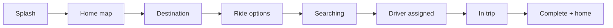

# Architecture — Vuum (iOS ride-hailing demo)

## Design rules

1. **SwiftUI first** — UIKit only for Google Maps (`UIViewRepresentable`)
2. **Mock trip layer** — drivers, fares, places, and phase transitions are local (no dispatch backend)
3. **Maps** — Google Maps SDK when `VUUM_GOOGLE_MAPS_API_KEY` / `GMSApiKey` is set; otherwise placeholder surface
4. **Codemagic** — unsigned IPA for Sideloadly (same delivery pattern as the Wells scaffold)

Infrastructure patterns (module folders, Xcode project layout, Codemagic unsigned build) were adapted from the Wells Gas Monitor reference app. **Product screens and branding are original to Vuum.**

---

## Demo flow



`TripSession` owns `TripPhase`: `idle → selectingDestination → choosingRide → searching → assigned → inTrip → completed`.

---

## Code modules (`ios/Vuum/`)

```
App/           VuumApp, ContentView, RootFlowView
Models/        TripPhase, Place, RideTier, DriverProfile, ActiveTrip
Services/      TripSession (state machine)
Mock/          MockPlaces, MockDrivers, MockFares
Maps/          MapBootstrap, VuumMapView (UIKit bridge)
UI/Theme/      VuumColor, VuumTheme (+ ComponentsKit accent)
UI/Components/ Glass, chrome buttons, UIKit share bridge
UI/Flow/       Splash + flow scaffolds (to be polished)
Assets         AppIcon + AccentColor + SplashBackground (+ dark) + AuthIcon* imagesets (Google PNG; Apple/Email SF Symbol fallbacks)
```

### UI frameworks (from Wells scaffold + Vuum maps)

| Piece | Role |
|-------|------|
| SwiftUI | Screens |
| UIKit | `VuumMapView`, `VuumActivityView` |
| ComponentsKit SPM | Linked; accent configured at launch |
| Explore SwiftUI | External snippet reference (see `reference/README.md`) |
| Google Maps SPM | Live map when API key is set |

---

## What is intentionally not in this demo yet

- Real payments / auth / push
- Full dispatch / matching backend
- Polished visual design pass on every sheet (scaffolds are functional)
- Firebase / BLE (Wells product-only — not part of Vuum framework)
